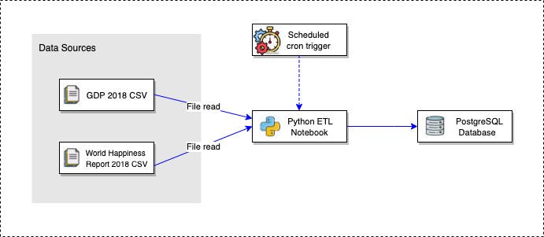
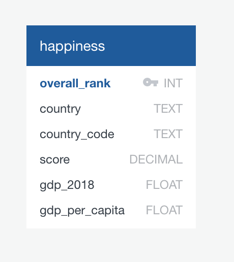
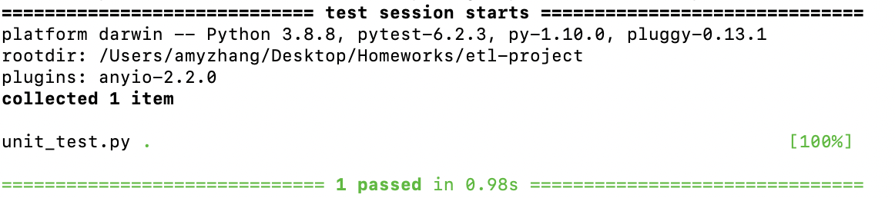

# Purpose and Motivation

Our motivation for the project is to answer the question: "Does money contribute to happiness?" and see weather there is a correlation between the two variables.

As data engineers, we sourced the World Happiness Report of 2018 and GDP 2018 by country both from Kaggle.com to provide insights for our data analysts.

# Solution
## Solution Architecture

# Extraction

After identidying the data sources that will be used, our next task was to extract the data. As the files we used are csv files, we used Pandas to read into the files and converted them into databases in order to perform the next step.

# Transformation

This step required a lot of data cleaning. We removed the unncessary columns for both databases and renamed the columns as well. 

The next challenge was to merge the two databases together into a clean one which we could use to perform the loading step.

# Loading 
## Entity Relationship Dictionary:

## Data Dictionary

Below are the data defintions for the following our "happiness" table:

|Column Name|Definition|
|:----------|:----------|
|overall_rank|The rank of national happiness bases on various life factors|
|country|The name of the country|
|country code|The code to represent each country|
|score|The happiness score (out of a possible score of 10)|
|gdp_2018|The gdp of the corresponding country for the year 2018|
|gdp_per_capita|The economic output per prson in that corresponding country| 

# Usage

## Running Unit Tests

To run the unit test on your computer, execute the following into your terminal:
pytest unit_test.py

You should see the following output:

## Python Dependencies
The required python libraries/dependencies have been specified below:
* Pandas=1.3.2
* Sqlalchemy=1.4.26

